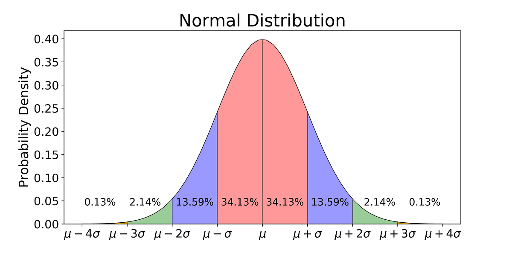
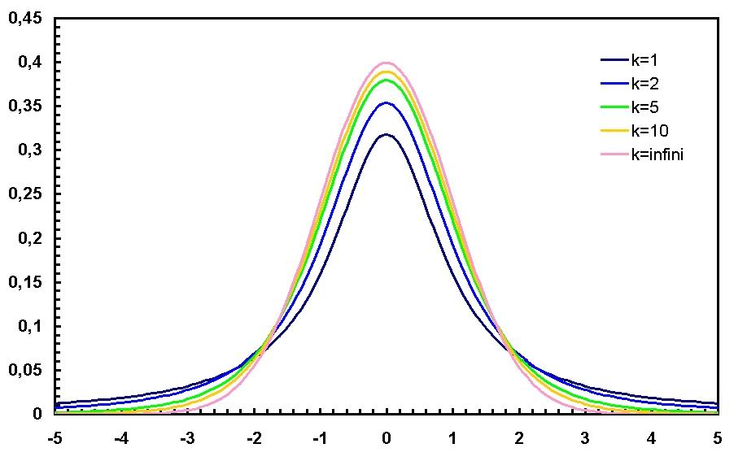

# Statistics and Probability

## Table of Contents

1. [Population and Sampling](#population-and-sampling)
2. [Descriptive Statistics](#descriptive-statistics)
3. [Probability Distributions](#probability-distributions)
4. [Statistical Inference](#statistical-inference)
5. [Correlation and Covariance](#correlation-and-covariance)
6. [Distance Metrics](#distance-metrics)

## Population and Sampling

### Population vs Sample

**Population (General Set)** - the complete set of all possible observations or cases that could exist.

**Sample** - a subset of the population selected for analysis.

There are two types of observation:
- **Complete observation** - studying the entire population (all possible and existing cases)
- **Sample observation** - selecting a representative sample from the population for analysis and making predictions about the entire population

In most cases, we work with sample observations, so we must understand the margin of error by which our sample statistics may differ from population parameters.

### Unbiased Estimators

**Unbiased Estimator** - a sample statistic that, with repeated sampling, tends toward its theoretical (population) value.

Why is it called an "estimator"? Because we don't know the real value of the parameter (for the population), and we use sample observation to estimate it. An estimate is a characteristic calculated from a sample.

### Sampling Methods

Common sampling techniques:
- **Simple random sample** - each member has equal probability of selection
- **Stratified sample** - population divided into homogeneous groups (strata), then random sampling within each stratum
- **Cluster sample** - population divided into clusters, some clusters randomly selected, all members in selected clusters studied

## Descriptive Statistics

### Measures of Central Tendency

**Arithmetic Mean (Sample Mean)** - the average value in a sample:

$$\bar{x} = \frac{1}{n}\sum_{i=1}^{n} x_i$$

**Expected Value (Mathematical Expectation)** - the average value of a random variable as the number of samples or measurements approaches infinity:

$$E[X] = \mu = \lim_{n \to \infty} \frac{1}{n}\sum_{i=1}^{n} x_i$$

**Sample Mean** is an unbiased estimator of the expected value, since the average of sample means converges to its theoretical value for the population.

**Median** - the value that divides the sample such that exactly half of it is greater and the other half is smaller. The median doesn't necessarily coincide with the mean. The deviation of the median from the mean is called **skewness**.

**Mode** - the most frequently occurring value in the dataset.

### Measures of Dispersion

**Variance** - a measure of spread of a random variable around its expected value, or alternatively, the expected value of deviations from the expected value:

$$\sigma^2 = E[(X - \mu)^2] = E[X^2] - (E[X])^2$$

**Sample Variance (Biased)**:

$$s^2 = \frac{1}{n}\sum_{i=1}^{n}(x_i - \bar{x})^2$$

**Sample Variance (Unbiased)**:

$$s^2 = \frac{1}{n-1}\sum_{i=1}^{n}(x_i - \bar{x})^2$$

Unbiasedness is an important characteristic of a statistical measure. A biased estimator indicates a tendency toward error. To solve the problem of sample variance bias, a correction is introduced - multiply by $\frac{n}{n-1}$, or immediately use $n-1$ in the denominator instead of $n$.

For large sample sizes (over 100 observations), the difference between biased and unbiased variance practically disappears.

**Standard Deviation (std)** - a measure of dispersion of random variable values around the expected value (equals the square root of variance):

$$\sigma = \sqrt{Var(X)} = \sqrt{E[(X-\mu)^2]}$$

Standard deviation has the same units as the original data, making it more interpretable than variance.

### Skewness and Distribution Shape

**Skewness** - a characteristic of how much the mode differs from the mean. Skewness can be positive or negative depending on the direction of distribution shift.

- **Positive skew** (right-skewed): mean > median > mode
- **Negative skew** (left-skewed): mean < median < mode
- **No skew** (symmetric): mean ≈ median ≈ mode

**Kurtosis** - a measure of the "tailedness" of the distribution. High kurtosis indicates heavy tails (more outliers).

## Probability Distributions

### Common Distributions

**Bernoulli Distribution** - discrete probability distribution modeling a random experiment with known probability of success or failure:

$$P(X=1) = p, \quad P(X=0) = 1-p$$

where $p$ is the probability of success.

**Binomial Distribution** - the number of successes in $n$ independent Bernoulli trials:

$$P(X=k) = \binom{n}{k}p^k(1-p)^{n-k}$$

**Normal Distribution (Gaussian)** - continuous probability distribution with probability density function:

$$f(x) = \frac{1}{\sigma\sqrt{2\pi}}e^{-\frac{(x-\mu)^2}{2\sigma^2}}$$

Distribution diagram:



Properties:
- Symmetric around the mean
- Mean = median = mode
- 68% of data within 1 standard deviation
- 95% of data within 2 standard deviations
- 99.7% of data within 3 standard deviations

**Student's t-Distribution** - used when sample size is small and population standard deviation is unknown. The shape is determined by degrees of freedom: $df = n - 1$

The t-statistic:

$$t = \frac{\bar{x} - \mu}{s / \sqrt{n}}$$

where $s$ is the sample standard deviation.

Distribution diagram:



## Statistical Inference

### Standard Error and Confidence Intervals

**Standard Error of the Mean** - a measure characterizing the standard deviation of the sample mean, calculated from a sample of size $n$ from the population:

**Central Limit Theorem**: When extracting a sample from a population, the sample mean will be at the same point with an error equal to:

$$SE = \frac{\sigma}{\sqrt{n}}$$

where $\sigma$ is the population standard deviation and $n$ is the sample size.

**Confidence Interval** - an interval in which a random variable falls with a given significance level.

For estimating the population mean:
- **95% confidence**: $\bar{x} = \mu \pm 1.96 \cdot SE$
- **99% confidence**: $\bar{x} = \mu \pm 2.58 \cdot SE$

where:
- $\bar{x}$ is the sample mean
- $\mu$ is the population mean
- $SE$ is the standard error

**Margin of Error** - a statistical quantity determining, with a certain degree of probability, the maximum value by which sample results differ from population results. It equals half the length of the confidence interval.

### Hypothesis Testing

**Significance Level ($\alpha$)** - denotes the probability of obtaining a random deviation from established results with a certain probability. This parameter is set manually and usually takes values: 0.05, 0.01, 0.001.

**Confidence Level** - the probability that the value of a random variable falls within the confidence interval. Equals: $1 - \alpha$ (significance level).

**p-value** - the probability of obtaining test results at least as extreme as the observed results, assuming the null hypothesis is true.
- If p-value < $\alpha$: reject the null hypothesis
- If p-value ≥ $\alpha$: fail to reject the null hypothesis

### Z-Score (Standardized Score)

**Z-Score** - a measure of relative spread of an observed or measured value, showing how many standard deviations its spread is relative to the mean. It's a dimensionless statistical indicator used to compare values of different dimensions or measurement scales:

$$Z = \frac{x - \mu}{\sigma}$$

where:
- $x$ is the observed value
- $\mu$ is the population mean
- $\sigma$ is the population standard deviation

Z-scores are extremely important for:
- Identifying outliers (typically |Z| > 3)
- Standardizing features for machine learning
- Comparing values on different scales

**Example usage in Python:**

```python
# Remove outliers using Z-score
from scipy import stats
import numpy as np

newtrain = train[(np.abs(stats.zscore(train.select_dtypes(include=np.number))) < 3).all(axis=1)]
```

Mathematical interpretation: values beyond ±3 standard deviations are considered outliers (representing less than 0.3% of data in normal distribution).

## Correlation and Covariance

### Covariance

**Covariance** - a measure of linear dependence between two random variables (shows how much two values are linearly related):

$$Cov(X,Y) = E[(X - E[X])(Y - E[Y])]$$

Properties:
- Positive covariance: variables tend to move together
- Negative covariance: variables tend to move in opposite directions
- Zero covariance: no linear relationship (but non-linear relationship may exist)

Sample covariance:

$$Cov(X,Y) = \frac{1}{n-1}\sum_{i=1}^{n}(x_i - \bar{x})(y_i - \bar{y})$$

### Correlation

**Pearson Correlation Coefficient** - normalized covariance ranging from -1 to 1:

$$r = \frac{Cov(X,Y)}{\sigma_X \sigma_Y} = \frac{\sum_{i=1}^{n}(x_i-\bar{x})(y_i-\bar{y})}{\sqrt{\sum_{i=1}^{n}(x_i-\bar{x})^2}\sqrt{\sum_{i=1}^{n}(y_i-\bar{y})^2}}$$

Properties:
- $r = 1$: perfect positive linear correlation
- $r = -1$: perfect negative linear correlation
- $r = 0$: no linear correlation
- $|r| > 0.7$: strong correlation
- $0.3 < |r| < 0.7$: moderate correlation
- $|r| < 0.3$: weak correlation

**When to use Pearson correlation:**
- Data is normally distributed
- Linear relationship between variables
- No significant outliers

**Spearman's Rank Correlation** - less sensitive to non-normality and non-linearity of data. Uses ranks instead of raw values:

$$\rho = 1 - \frac{6\sum d_i^2}{n(n^2-1)}$$

where $d_i$ is the difference between ranks.

**When to use:**
- Non-normal distributions
- Ordinal data
- Non-linear monotonic relationships
- Presence of outliers

## Distance Metrics

### Common Distance Measures

**Euclidean Distance** - straight-line distance between two points:

$$d(x,y) = \sqrt{\sum_{i=1}^{n}(x_i - y_i)^2}$$

**Manhattan Distance** (L1 norm) - sum of absolute differences:

$$d(x,y) = \sum_{i=1}^{n}|x_i - y_i|$$

**Cosine Similarity** - measures the cosine of the angle between two vectors:

$$similarity = \cos(\theta) = \frac{A \cdot B}{||A|| \cdot ||B||} = \frac{\sum_{i=1}^{n}A_i B_i}{\sqrt{\sum_{i=1}^{n}A_i^2}\sqrt{\sum_{i=1}^{n}B_i^2}}$$

Often used for text similarity: each document is described by a vector where each component corresponds to a word from the vocabulary. The component equals one if the word appears in the text, and zero otherwise. The cosine between two vectors will be larger when more words appear simultaneously in both documents.

Cosine distance: $distance = 1 - similarity$

## Analysis of Variance (ANOVA)

**Sum of Squares Total (SST)** - total variation in the data:

$$SST = \sum_{i=1}^{n}(x_i - \bar{x})^2$$

**Sum of Squares Within (SSW)** - within-group variability, calculated for each subgroup.

**Sum of Squares Between (SSB)** - between-group variability.

**Degrees of Freedom** - the number of elements that can vary when calculating a statistical measure: $df = n - 1$

### When to Use Different Tests

- **Two quantitative variables**: use correlation analysis or linear regression
- **One nominal, one quantitative variable**: use t-test or ANOVA
- **Two nominal variables**: use chi-square test

## Practical Considerations

### Checking Assumptions

Before applying statistical tests:
1. Check for normality (Q-Q plots, Shapiro-Wilk test)
2. Check for homoscedasticity (constant variance)
3. Check for independence of observations
4. Look for outliers

### Multiple Comparisons

**Bonferroni Correction** - adjusts significance level when performing multiple tests:

$$\alpha_{adjusted} = \frac{\alpha}{m}$$

where $m$ is the number of comparisons.

**Tukey's HSD Test** - alternative to Student's t-test for multiple comparisons, controls family-wise error rate.

## References

- [Unbiased Sample Variance - Excellent Article](https://statanaliz.info/statistica/opisanie-dannyx/vyborochnaya-dispersiya/) (Russian)
- [Distance Metrics Overview](https://delirium-00.livejournal.com/7215.html) (Russian)
- Introduction to Statistical Learning (James, Witten, Hastie, Tibshirani)
- All of Statistics (Larry Wasserman)
