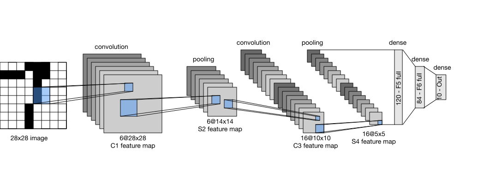

# LeNet - The Pioneer of CNNs

## Table of Contents

1. [Overview](#overview)
2. [Architecture](#architecture)
3. [Key Components](#key-components)
4. [Mathematical Foundation](#mathematical-foundation)
5. [Implementation Details](#implementation-details)
6. [Historical Impact](#historical-impact)
7. [Limitations](#limitations)

## Overview

**LeNet-5** is a pioneering convolutional neural network developed by Yann LeCun and colleagues at AT&T Bell Labs in 1998. It was designed for handwritten digit recognition and became the foundation for modern CNNs.

**Original application**: Reading handwritten zip codes and bank checks

**Year**: 1998

**Key innovations**:
- First successful application of backpropagation to CNNs
- Demonstrated the effectiveness of convolutional layers
- Introduced the pattern: Conv → Pool → Conv → Pool → FC

## Architecture

LeNet-5 consists of 7 layers (not counting input):

```
Input (32×32)
    ↓
C1: Conv (6 filters, 5×5) → 28×28×6
    ↓
S2: AvgPool (2×2) → 14×14×6
    ↓
C3: Conv (16 filters, 5×5) → 10×10×16
    ↓
S4: AvgPool (2×2) → 5×5×16
    ↓
C5: Conv (120 filters, 5×5) → 1×1×120
    ↓
F6: Fully Connected (84 units)
    ↓
Output: Fully Connected (10 units - digits 0-9)
```

### Layer-by-Layer Breakdown

| Layer | Type | Input Size | Output Size | Parameters |
|-------|------|-----------|-------------|------------|
| Input | Image | 32×32×1 | 32×32×1 | 0 |
| C1 | Conv 5×5 | 32×32×1 | 28×28×6 | 156 |
| S2 | AvgPool 2×2 | 28×28×6 | 14×14×6 | 12 |
| C3 | Conv 5×5 | 14×14×6 | 10×10×16 | 1,516 |
| S4 | AvgPool 2×2 | 10×10×16 | 5×5×16 | 32 |
| C5 | Conv 5×5 | 5×5×16 | 1×1×120 | 48,120 |
| F6 | Fully Connected | 120 | 84 | 10,164 |
| Output | Fully Connected | 84 | 10 | 850 |

**Total parameters**: ~60,000

### Architecture Diagram



*Source: Wikimedia Commons, CC BY-SA 4.0*

## Key Components

### Convolutional Layers

**Purpose**: Extract local features from the input image

Each convolutional layer applies multiple filters to detect different features:
- **C1**: Detects basic edges and curves
- **C3**: Combines features from C1 into more complex patterns
- **C5**: High-level feature extraction

**Convolution operation**:

$$y_{i,j} = \sum_{m=0}^{k-1} \sum_{n=0}^{k-1} w_{m,n} \cdot x_{i+m, j+n} + b$$

where:
- $w$ is the filter kernel
- $x$ is the input
- $b$ is the bias
- $k$ is the kernel size

### Subsampling Layers (Pooling)

LeNet-5 used **average pooling** (not max pooling like modern CNNs):

$$y_{i,j} = \frac{1}{4}\sum_{m=0}^{1}\sum_{n=0}^{1} x_{2i+m, 2j+n}$$

**Purpose**:
- Reduce spatial dimensions
- Introduce translation invariance
- Reduce computational cost
- Prevent overfitting

### Activation Function

Original LeNet-5 used **tanh** (hyperbolic tangent):

$$\tanh(x) = \frac{e^x - e^{-x}}{e^x + e^{-x}}$$

Properties:
- Output range: [-1, 1]
- Centered around zero
- Smooth gradient

Modern implementations often replace tanh with **ReLU** for faster training.

## Mathematical Foundation

### Forward Propagation

For a convolutional layer:

$$\text{Output}_{i,j,k} = f\left(\sum_{c=1}^{C} \sum_{m=0}^{K-1} \sum_{n=0}^{K-1} W_{k,c,m,n} \cdot X_{c,i+m,j+n} + b_k\right)$$

where:
- $i, j$ are spatial coordinates
- $k$ is the output channel
- $c$ is the input channel
- $K$ is kernel size
- $f$ is the activation function

### Receptive Field

The **receptive field** is the region of the input that affects a particular neuron.

For LeNet-5:
- After C1: 5×5
- After S2: 6×6
- After C3: 14×14
- After S4: 16×16

**Receptive field growth**:

$$RF_l = RF_{l-1} + (k_l - 1) \times \prod_{i=1}^{l-1} s_i$$

where $k_l$ is kernel size and $s_i$ are strides of previous layers.

## Implementation Details

### Modern PyTorch Implementation

```python
import torch
import torch.nn as nn

class LeNet5(nn.Module):
    def __init__(self, num_classes=10):
        super(LeNet5, self).__init__()

        # Feature extraction
        self.conv1 = nn.Conv2d(1, 6, kernel_size=5, stride=1, padding=0)
        self.pool1 = nn.AvgPool2d(kernel_size=2, stride=2)

        self.conv2 = nn.Conv2d(6, 16, kernel_size=5, stride=1, padding=0)
        self.pool2 = nn.AvgPool2d(kernel_size=2, stride=2)

        self.conv3 = nn.Conv2d(16, 120, kernel_size=5, stride=1, padding=0)

        # Classification
        self.fc1 = nn.Linear(120, 84)
        self.fc2 = nn.Linear(84, num_classes)

        # Activation
        self.tanh = nn.Tanh()

    def forward(self, x):
        # Input: (batch, 1, 32, 32)
        x = self.tanh(self.conv1(x))  # (batch, 6, 28, 28)
        x = self.pool1(x)              # (batch, 6, 14, 14)

        x = self.tanh(self.conv2(x))  # (batch, 16, 10, 10)
        x = self.pool2(x)              # (batch, 16, 5, 5)

        x = self.tanh(self.conv3(x))  # (batch, 120, 1, 1)
        x = x.view(x.size(0), -1)      # (batch, 120) - flatten

        x = self.tanh(self.fc1(x))    # (batch, 84)
        x = self.fc2(x)                # (batch, num_classes)

        return x
```

### Modern Variant with ReLU

```python
class ModernLeNet(nn.Module):
    def __init__(self, num_classes=10):
        super(ModernLeNet, self).__init__()

        self.features = nn.Sequential(
            nn.Conv2d(1, 6, kernel_size=5),
            nn.ReLU(inplace=True),
            nn.MaxPool2d(kernel_size=2, stride=2),

            nn.Conv2d(6, 16, kernel_size=5),
            nn.ReLU(inplace=True),
            nn.MaxPool2d(kernel_size=2, stride=2),
        )

        self.classifier = nn.Sequential(
            nn.Linear(16 * 5 * 5, 120),
            nn.ReLU(inplace=True),
            nn.Linear(120, 84),
            nn.ReLU(inplace=True),
            nn.Linear(84, num_classes),
        )

    def forward(self, x):
        x = self.features(x)
        x = x.view(x.size(0), -1)
        x = self.classifier(x)
        return x
```

### Training Configuration

Original training setup:
- **Dataset**: MNIST (handwritten digits)
- **Input size**: 32×32 grayscale images
- **Optimizer**: Stochastic gradient descent
- **Loss**: Mean squared error (MSE)
- **Learning rate**: Adaptive (decreased over time)

Modern training setup:
```python
model = ModernLeNet(num_classes=10)
criterion = nn.CrossEntropyLoss()
optimizer = torch.optim.Adam(model.parameters(), lr=0.001)

# Training loop
for epoch in range(num_epochs):
    for images, labels in train_loader:
        optimizer.zero_grad()
        outputs = model(images)
        loss = criterion(outputs, labels)
        loss.backward()
        optimizer.step()
```

## Historical Impact

### Achievements

1. **Proven concept**: Demonstrated that CNNs could learn hierarchical features
2. **Commercial success**: Deployed in ATMs and postal services for check/zip code reading
3. **Foundation**: Established the convolutional paradigm still used today
4. **Inspiration**: Led to development of AlexNet, VGG, ResNet, and other architectures

### Design Principles Still Used Today

- **Local connectivity**: Neurons connect to local regions, not entire input
- **Weight sharing**: Same filter applied across entire image
- **Spatial hierarchy**: Layers progressively extract higher-level features
- **Alternating pattern**: Convolution → activation → pooling pattern

## Limitations

### Compared to Modern Architectures

1. **Shallow**: Only 3 convolutional layers
   - Modern networks have 50-200+ layers

2. **Small receptive field**: Limited context window
   - Cannot capture large-scale patterns

3. **Low capacity**: ~60K parameters
   - Modern models have millions to billions of parameters

4. **Simple features**: Designed for simple grayscale digits
   - Not suitable for complex natural images

5. **Activation function**: Tanh is slower than ReLU
   - Tanh has vanishing gradient problems

6. **Pooling**: Average pooling loses information
   - Max pooling is generally more effective

7. **No normalization**: No batch normalization or other techniques
   - Makes training deeper networks difficult

### When LeNet is Still Useful

Despite limitations, LeNet is valuable for:
- **Educational purposes**: Understanding CNN fundamentals
- **Simple tasks**: MNIST, basic digit/character recognition
- **Resource-constrained**: Embedded systems, mobile devices
- **Baseline model**: Quick prototyping and comparison

## Performance

### On MNIST Dataset

- **Original LeNet-5**: ~99.05% accuracy
- **Modern variant**: ~99.3% accuracy
- **Modern SOTA**: ~99.8% accuracy (with data augmentation, ensembles)

### Inference Speed

- **Very fast**: ~60K parameters means minimal computation
- **Suitable for**: Real-time applications on CPU
- **Throughput**: Thousands of images per second on modern hardware

## Comparison with Later Architectures

| Aspect | LeNet-5 | AlexNet | ResNet-50 |
|--------|---------|---------|-----------|
| Year | 1998 | 2012 | 2015 |
| Layers | 7 | 8 | 50 |
| Parameters | 60K | 60M | 25M |
| Input Size | 32×32 | 224×224 | 224×224 |
| Activation | Tanh | ReLU | ReLU |
| Normalization | None | LRN | Batch Norm |

## References

- Yann LeCun et al. "Gradient-Based Learning Applied to Document Recognition" (1998)
- [Original Paper](http://yann.lecun.com/exdb/publis/pdf/lecun-01a.pdf)
- Yann LeCun's website: [http://yann.lecun.com/](http://yann.lecun.com/)
- MNIST Database: [http://yann.lecun.com/exdb/mnist/](http://yann.lecun.com/exdb/mnist/)
