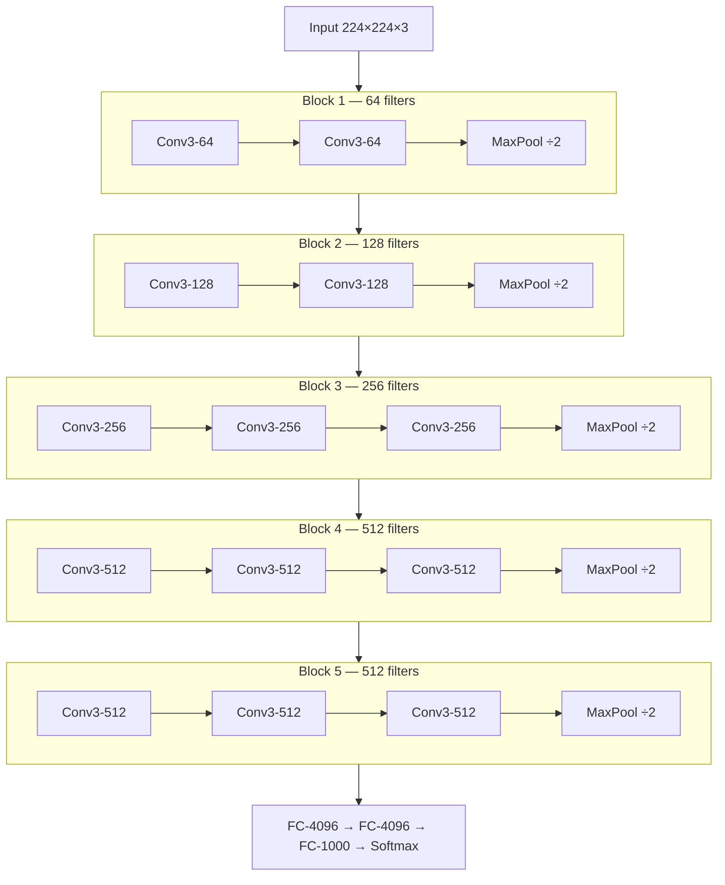
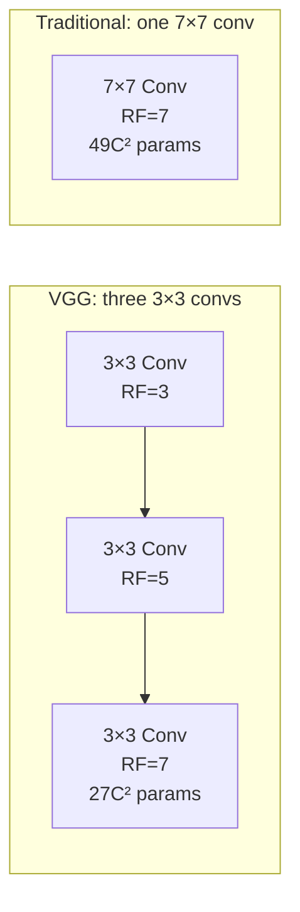

# VGG - Very Deep Convolutional Networks

## Table of Contents

1. [Overview](#overview)
2. [Architecture](#architecture)
3. [Design Philosophy](#design-philosophy)
4. [Mathematical Details](#mathematical-details)
5. [Implementation](#implementation)
6. [Training Details](#training-details)
7. [Analysis and Impact](#analysis-and-impact)

## Overview

**VGG** (Visual Geometry Group) networks are deep convolutional neural networks developed by the Visual Geometry Group at Oxford University. VGG demonstrated that network depth is a critical component of good performance.

**Authors**: Karen Simonyan and Andrew Zisserman (University of Oxford)

**Year**: 2014

**Achievement**: 2nd place in ILSVRC 2014 classification (7.3% error), 1st place in localization

**Key principle**: **Deeper is better** - use very deep networks with very small (3×3) convolution filters

**Variants**: VGG-11, VGG-13, VGG-16, VGG-19 (most popular: VGG-16 and VGG-19)

## Architecture

### VGG-16 Architecture

```
Input: 224×224×3
    ↓
Block 1:
  Conv3-64 → Conv3-64 → MaxPool
    ↓ (112×112×64)
Block 2:
  Conv3-128 → Conv3-128 → MaxPool
    ↓ (56×56×128)
Block 3:
  Conv3-256 → Conv3-256 → Conv3-256 → MaxPool
    ↓ (28×28×256)
Block 4:
  Conv3-512 → Conv3-512 → Conv3-512 → MaxPool
    ↓ (14×14×512)
Block 5:
  Conv3-512 → Conv3-512 → Conv3-512 → MaxPool
    ↓ (7×7×512)
Flatten → FC-4096 → FC-4096 → FC-1000 → Softmax
```

**Notation**: Conv3-64 means 3×3 convolution with 64 filters



### VGG Family Comparison

| Layer Type | VGG-11 | VGG-13 | VGG-16 | VGG-19 |
|------------|--------|--------|--------|--------|
| Conv layers | 8 | 10 | 13 | 16 |
| FC layers | 3 | 3 | 3 | 3 |
| **Total** | **11** | **13** | **16** | **19** |
| Parameters | 133M | 133M | 138M | 144M |

### VGG-16 Layer Details

| Block | Layer | Output Shape | Parameters |
|-------|-------|--------------|------------|
| Input | - | 224×224×3 | 0 |
| 1 | Conv3-64 | 224×224×64 | 1,792 |
| 1 | Conv3-64 | 224×224×64 | 36,928 |
| 1 | MaxPool | 112×112×64 | 0 |
| 2 | Conv3-128 | 112×112×128 | 73,856 |
| 2 | Conv3-128 | 112×112×128 | 147,584 |
| 2 | MaxPool | 56×56×128 | 0 |
| 3 | Conv3-256 | 56×56×256 | 295,168 |
| 3 | Conv3-256 | 56×56×256 | 590,080 |
| 3 | Conv3-256 | 56×56×256 | 590,080 |
| 3 | MaxPool | 28×28×256 | 0 |
| 4 | Conv3-512 | 28×28×512 | 1,180,160 |
| 4 | Conv3-512 | 28×28×512 | 2,359,808 |
| 4 | Conv3-512 | 28×28×512 | 2,359,808 |
| 4 | MaxPool | 14×14×512 | 0 |
| 5 | Conv3-512 | 14×14×512 | 2,359,808 |
| 5 | Conv3-512 | 14×14×512 | 2,359,808 |
| 5 | Conv3-512 | 14×14×512 | 2,359,808 |
| 5 | MaxPool | 7×7×512 | 0 |
| FC | FC-4096 | 4096 | 102,764,544 |
| FC | FC-4096 | 4096 | 16,781,312 |
| FC | FC-1000 | 1000 | 4,097,000 |

**Total parameters**: ~138 million (most in FC layers)

## Design Philosophy

### Core Principles

1. **Small filters only**: All convolutions use 3×3 filters (and some 1×1)
2. **Fixed stride**: Convolution stride fixed to 1 pixel
3. **Same padding**: Spatial resolution preserved after convolution
4. **Max pooling**: 2×2 windows with stride 2
5. **Progressive depth**: Double filters after each pooling

### Why 3×3 Filters?

**Two 3×3 convolutions** = **One 5×5 convolution** (receptive field)

**Three 3×3 convolutions** = **One 7×7 convolution**



**Advantages of stacking small filters**:

1. **Fewer parameters**:
   - One 7×7 conv: $7 \times 7 \times C \times C = 49C^2$ parameters
   - Three 3×3 convs: $3 \times (3 \times 3 \times C \times C) = 27C^2$ parameters
   - **Reduction**: ~45% fewer parameters

2. **More non-linearity**:
   - More ReLU activations between layers
   - More decision functions
   - Better feature learning

3. **Deeper networks**:
   - Same receptive field with more layers
   - Better feature hierarchies

### Receptive Field Calculation

For stacked 3×3 convolutions with padding=1:

$$RF_n = 1 + n \times (k - 1)$$

where $k=3$ for 3×3 kernels.

**Examples**:
- 1× Conv3: $RF = 1 + 1(3-1) = 3$
- 2× Conv3: $RF = 1 + 2(3-1) = 5$ (equivalent to 5×5)
- 3× Conv3: $RF = 1 + 3(3-1) = 7$ (equivalent to 7×7)

### Architectural Pattern

VGG follows a simple, regular pattern:

```
[Conv3 × N] → MaxPool → [Conv3 × N] → MaxPool → ...
```

where:
- N increases with depth (2, 2, 3, 3, 3 for VGG-16)
- Filters double after each MaxPool (64 → 128 → 256 → 512 → 512)
- Spatial dimensions halve after each MaxPool

## Mathematical Details

### Convolution with Padding

To maintain spatial dimensions with 3×3 kernels:

$$\text{Output Size} = \left\lfloor \frac{W - K + 2P}{S} \right\rfloor + 1$$

For VGG: $W=W, K=3, P=1, S=1$:

$$\text{Output Size} = \frac{W - 3 + 2}{1} + 1 = W$$

Spatial size stays the same!

### Parameter Count

For a convolutional layer:

$$\text{Params} = (K \times K \times C_{in} + 1) \times C_{out}$$

where:
- $K$ is kernel size
- $C_{in}$ is input channels
- $C_{out}$ is output channels
- $+1$ accounts for bias

**Example** (Conv3-512 after Conv3-512):

$$\text{Params} = (3 \times 3 \times 512 + 1) \times 512 = 2,359,808$$

### Memory Requirements

**Feature maps memory** (forward pass, batch size 1):

$$\text{Memory} = \sum_{\text{layers}} H \times W \times C \times 4 \text{ bytes}$$

For VGG-16: ~96 MB per image (float32)

**Total memory** (with gradients for training):
- Forward: ~96 MB
- Backward: ~96 MB (gradients)
- Parameters: ~553 MB
- **Total**: ~750 MB per image

## Implementation

### PyTorch Implementation (VGG-16)

```python
import torch
import torch.nn as nn

class VGG16(nn.Module):
    def __init__(self, num_classes=1000):
        super(VGG16, self).__init__()

        self.features = nn.Sequential(
            # Block 1
            nn.Conv2d(3, 64, kernel_size=3, padding=1),
            nn.ReLU(inplace=True),
            nn.Conv2d(64, 64, kernel_size=3, padding=1),
            nn.ReLU(inplace=True),
            nn.MaxPool2d(kernel_size=2, stride=2),

            # Block 2
            nn.Conv2d(64, 128, kernel_size=3, padding=1),
            nn.ReLU(inplace=True),
            nn.Conv2d(128, 128, kernel_size=3, padding=1),
            nn.ReLU(inplace=True),
            nn.MaxPool2d(kernel_size=2, stride=2),

            # Block 3
            nn.Conv2d(128, 256, kernel_size=3, padding=1),
            nn.ReLU(inplace=True),
            nn.Conv2d(256, 256, kernel_size=3, padding=1),
            nn.ReLU(inplace=True),
            nn.Conv2d(256, 256, kernel_size=3, padding=1),
            nn.ReLU(inplace=True),
            nn.MaxPool2d(kernel_size=2, stride=2),

            # Block 4
            nn.Conv2d(256, 512, kernel_size=3, padding=1),
            nn.ReLU(inplace=True),
            nn.Conv2d(512, 512, kernel_size=3, padding=1),
            nn.ReLU(inplace=True),
            nn.Conv2d(512, 512, kernel_size=3, padding=1),
            nn.ReLU(inplace=True),
            nn.MaxPool2d(kernel_size=2, stride=2),

            # Block 5
            nn.Conv2d(512, 512, kernel_size=3, padding=1),
            nn.ReLU(inplace=True),
            nn.Conv2d(512, 512, kernel_size=3, padding=1),
            nn.ReLU(inplace=True),
            nn.Conv2d(512, 512, kernel_size=3, padding=1),
            nn.ReLU(inplace=True),
            nn.MaxPool2d(kernel_size=2, stride=2),
        )

        self.avgpool = nn.AdaptiveAvgPool2d((7, 7))

        self.classifier = nn.Sequential(
            nn.Linear(512 * 7 * 7, 4096),
            nn.ReLU(inplace=True),
            nn.Dropout(0.5),

            nn.Linear(4096, 4096),
            nn.ReLU(inplace=True),
            nn.Dropout(0.5),

            nn.Linear(4096, num_classes),
        )

    def forward(self, x):
        x = self.features(x)
        x = self.avgpool(x)
        x = torch.flatten(x, 1)
        x = self.classifier(x)
        return x
```

### Configurable VGG Implementation

```python
class VGG(nn.Module):
    def __init__(self, config, num_classes=1000):
        super(VGG, self).__init__()
        self.features = self._make_layers(config)
        self.classifier = nn.Sequential(
            nn.Linear(512 * 7 * 7, 4096),
            nn.ReLU(inplace=True),
            nn.Dropout(0.5),
            nn.Linear(4096, 4096),
            nn.ReLU(inplace=True),
            nn.Dropout(0.5),
            nn.Linear(4096, num_classes),
        )

    def _make_layers(self, config):
        layers = []
        in_channels = 3
        for x in config:
            if x == 'M':
                layers += [nn.MaxPool2d(kernel_size=2, stride=2)]
            else:
                layers += [
                    nn.Conv2d(in_channels, x, kernel_size=3, padding=1),
                    nn.ReLU(inplace=True)
                ]
                in_channels = x
        return nn.Sequential(*layers)

    def forward(self, x):
        x = self.features(x)
        x = x.view(x.size(0), -1)
        x = self.classifier(x)
        return x

# Configurations for different VGG variants
configs = {
    'VGG11': [64, 'M', 128, 'M', 256, 256, 'M', 512, 512, 'M', 512, 512, 'M'],
    'VGG13': [64, 64, 'M', 128, 128, 'M', 256, 256, 'M', 512, 512, 'M', 512, 512, 'M'],
    'VGG16': [64, 64, 'M', 128, 128, 'M', 256, 256, 256, 'M', 512, 512, 512, 'M', 512, 512, 512, 'M'],
    'VGG19': [64, 64, 'M', 128, 128, 'M', 256, 256, 256, 256, 'M', 512, 512, 512, 512, 'M', 512, 512, 512, 512, 'M'],
}

# Usage
model = VGG(configs['VGG16'], num_classes=1000)
```

### Using Pre-trained VGG

```python
from torchvision import models

# Load pre-trained VGG-16
model = models.vgg16(pretrained=True)

# For feature extraction
model.eval()
with torch.no_grad():
    features = model.features(images)  # Extract features only

# For transfer learning
for param in model.features.parameters():
    param.requires_grad = False  # Freeze feature extractor

# Replace classifier for new task
model.classifier[6] = nn.Linear(4096, num_new_classes)
```

## Training Details

### Original Training Setup

- **Dataset**: ImageNet ILSVRC 2012
- **Optimizer**: SGD with momentum (0.9)
- **Batch size**: 256
- **Weight decay**: $5 \times 10^{-4}$
- **Learning rate**: 0.01, decreased by factor of 10 when validation accuracy stopped improving
- **Dropout**: 0.5 in first two FC layers
- **Training time**: 2-3 weeks on 4 NVIDIA Titan GPUs

### Data Augmentation

1. **Random crop**: 224×224 from rescaled image
2. **Horizontal flip**: Random with p=0.5
3. **RGB color shift**: Random

**Multi-scale training**:
- Train with images rescaled to different sizes
- Improves robustness and accuracy

### Initialization

**Multi-scale evaluation** at test time:
- Rescale test images to several sizes
- Compute predictions for each
- Average the predictions

This improved performance by ~0.5-1%.

## Analysis and Impact

### Performance (ILSVRC 2014)

| Model | Top-1 Error | Top-5 Error | Parameters |
|-------|-------------|-------------|------------|
| VGG-11 | - | 10.4% | 133M |
| VGG-13 | - | 9.9% | 133M |
| VGG-16 | 28.5% | 9.9% | 138M |
| VGG-19 | 28.7% | 9.0% | 144M |

**Winning method** (GoogLeNet): 6.7% top-5 error

VGG won localization task and was 2nd in classification.

### Depth Analysis

**Key finding**: Increasing depth improves performance

| Depth | Top-5 Error | Improvement |
|-------|-------------|-------------|
| 11 | 10.4% | baseline |
| 13 | 9.9% | -0.5% |
| 16 | 9.9% | -0.5% |
| 19 | 9.0% | -1.4% |

But diminishing returns after 16-19 layers without residual connections.

### Advantages

1. **Simplicity**: Uniform architecture, easy to understand and implement
2. **Strong features**: Excellent feature extractor for transfer learning
3. **Proven design**: 3×3 convolutions became standard
4. **Good performance**: Competitive accuracy

### Disadvantages

1. **Memory intensive**: ~138M parameters, mostly in FC layers
2. **Slow**: Many parameters mean slow training and inference
3. **Inefficient FC layers**: 7×7×512 → 4096 FC layer has 102M parameters!
4. **Depth limitation**: Diminishing returns without skip connections

### Impact and Legacy

**What VGG proved**:
- Depth is crucial for performance
- Small (3×3) filters are sufficient and efficient
- Simple, uniform architectures can work well

**What VGG inspired**:
- **ResNet**: Solved depth problem with skip connections
- **Fully Convolutional Networks**: Replaced FC layers with convolutions
- **All modern CNNs**: Use 3×3 (and 1×1) filters almost exclusively

**Why VGG is still relevant**:
- **Transfer learning**: VGG features work well for many tasks
- **Simplicity**: Educational value, easy to understand
- **Feature extraction**: Pre-trained VGG widely used as backbone

## Comparison with Other Architectures

| Architecture | Year | Depth | Parameters | Top-5 Error | Key Feature |
|--------------|------|-------|------------|-------------|-------------|
| AlexNet | 2012 | 8 | 60M | 15.3% | ReLU, Dropout |
| VGG-16 | 2014 | 16 | 138M | 9.9% | Small filters, depth |
| VGG-19 | 2014 | 19 | 144M | 9.0% | Even deeper |
| GoogLeNet | 2014 | 22 | 6.8M | 6.7% | Inception modules |
| ResNet-50 | 2015 | 50 | 25M | 3.6% | Residual connections |

**Trade-off**: VGG has more parameters but simpler architecture than GoogLeNet.

## Modern Alternatives

For new projects, consider:

- **ResNet**: Better accuracy, fewer parameters
- **EfficientNet**: SOTA accuracy with efficiency
- **MobileNet**: For mobile/embedded devices
- **Vision Transformer**: Attention-based, SOTA on many tasks

But VGG remains valuable for:
- Transfer learning (good feature representations)
- Educational purposes
- Applications where simplicity matters

## References

- Karen Simonyan, Andrew Zisserman. "Very Deep Convolutional Networks for Large-Scale Image Recognition" ICLR (2015)
- [Original Paper](https://arxiv.org/abs/1409.1556)
- [PyTorch Implementation](https://pytorch.org/vision/stable/models.html#vgg)
- Visual Geometry Group, Oxford: [https://www.robots.ox.ac.uk/~vgg/](https://www.robots.ox.ac.uk/~vgg/)
